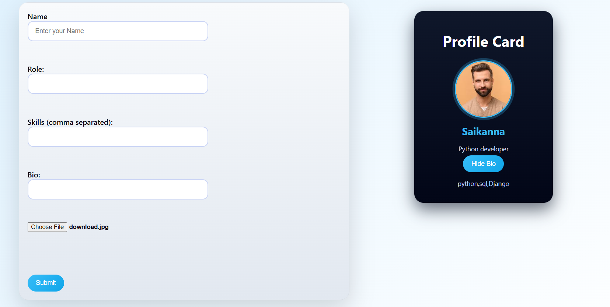

# Profile Card Creator

A modern React application that lets users create and display dynamic profile cards with image uploads, role selection, bio, and skills management.

## 🌐 Live Demo

🔗 **[View Live Application](https://saiheroforking.github.io/day-4)**

## 📦 Repository

🔗 **[GitHub Repository](https://github.com/saiheroforking/day-4)**

---

## 📋 Features

✅ **User Information Input** - Enter name, role, and bio  
✅ **Image Upload with Preview** - Upload and preview profile images in real-time  
✅ **Skills Management** - Add multiple skills (comma-separated)  
✅ **Dynamic Profile Card Display** - Real-time profile card rendering  
✅ **Bio Toggle** - Show/hide biography section  
✅ **Form Reset** - Automatic form clearing after submission  
✅ **Responsive Design** - Works seamlessly on all devices  
✅ **GitHub Pages Deployment** - Hosted on GitHub Pages  

---

## 📁 Folder Structure

```
day-4/
├── public/
│   ├── index.html
│   └── favicon.ico
├── src/
│   ├── components/
│   │   ├── ProfileForm.jsx
│   │   ├── ProfileCard.jsx
│   │   └── ProfileForm.css
│   │   └── ProfileCard.css
│   ├── App.jsx
│   ├── App.css
│   ├── index.js
│   └── index.css
├── package.json
├── package-lock.json
└── README.md
```

---

## 📖 File Explanations

| File | Purpose |
|------|---------|
| `src/App.jsx` | Main app component, state management |
| `src/components/ProfileForm.jsx` | Form for user input (name, role, bio, skills, image) |
| `src/components/ProfileCard.jsx` | Display profile card with user data |
| `src/App.css` | Global styles |
| `src/components/ProfileForm.css` | Form styling |
| `src/components/ProfileCard.css` | Profile card styling |
| `public/index.html` | HTML entry point |

---

## 🚀 Quick Start

### Prerequisites

- Node.js (v14 or higher)
- npm or yarn
- Git

### Installation Steps

**1️⃣ Clone the Repository**
```bash
git clone https://github.com/saiheroforking/day-4.git
```

**2️⃣ Navigate into the Project Folder**
```bash
cd day-4
```

**3️⃣ Install Dependencies**
```bash
npm install
```

**4️⃣ Start the Development Server**
```bash
npm start
```

✅ **The app will run at:** `http://localhost:3000`

---

## 🧪 How the Application Works

### User Workflow

1. User enters:
   - Name
   - Role
   - Bio
   - Skills (Comma separated)
   - Uploads a Profile Image

2. Clicks the Submit Button

3. The app:
   - Stores the data using `useState`
   - Displays the dynamic Profile Card
   - Shows uploaded image preview
   - Toggles Bio visibility

4. The form resets automatically after submission

### Example Input

```
Name: John Doe
Role: Full Stack Developer
Bio: Passionate about building scalable web applications
Skills: React, Node.js, MongoDB, JavaScript
Image: [Upload profile photo]
```

### Output

A beautiful profile card displaying all the information with the uploaded image.


---

## 🧠 React Concepts Used

✅ **useState() Hook** - State management for form and profile data  
✅ **Controlled Components** - Form inputs controlled by state  
✅ **Props Passing** - Data passed from parent to child components  
✅ **Conditional Rendering** - Display bio based on toggle state  
✅ **Event Handling** - Form submission and input changes  
✅ **Image Preview** - Using `URL.createObjectURL()` for image preview  

---

## 🚀 Deployment (GitHub Pages)

### Setup

Required in `package.json`:
```json
"homepage": "https://saiheroforking.github.io/day-4"
```

### Deployment Commands

```bash
# Build the app
npm run build

# Deploy to GitHub Pages
npm run deploy
```

### Steps

1. Ensure `gh-pages` is installed: `npm install --save-dev gh-pages`
2. Add deployment scripts to `package.json`:
   ```json
   "scripts": {
     "predeploy": "npm run build",
     "deploy": "gh-pages -d build"
   }
   ```
3. Run deployment command: `npm run deploy`
4. Visit your GitHub Pages URL to see the live app

---

## 🤝 Contributing

Contributions are welcome! Here's how to contribute:

1. **Fork the repository**
   ```bash
   Click "Fork" on GitHub
   ```

2. **Create a new branch:**
   ```bash
   git checkout -b feature-name
   ```

3. **Make your changes and commit:**
   ```bash
   git commit -m "Added new feature"
   ```

4. **Push to your branch:**
   ```bash
   git push origin feature-name
   ```

5. **Open a Pull Request**
   - Go to the original repository
   - Click "New Pull Request"
   - Select your branch and submit

---

## 🔮 Future Enhancements

Potential features to add:

- 🎨 **Theme Customization** - Light/Dark mode support
- 🖼️ **Image Filters** - Apply filters to profile images
- 💾 **Local Storage** - Persist user data across sessions
- 📤 **Export Profile** - Download profile as PDF or image
- 🔐 **User Authentication** - Sign up and login functionality
- 🌐 **Multi-language Support** - Support for multiple languages
- 📱 **Mobile App** - React Native version
- ✨ **Animation Effects** - Smooth transitions and animations

---

## 🧑‍💻 Author

**Sai Notla**  
GitHub: [@saiheroforking](https://github.com/saiheroforking)

---

## 📜 License

This project is licensed under the **MIT License** — you are free to use, modify, and distribute it.

See the LICENSE file for more details.

---

## 🎯 Badges


---

## ⭐ Support

If you found this project helpful, please:

- ⭐ **Star this repository** on GitHub
- 🔗 **Share** it with others
- 💬 **Provide feedback** or suggestions
- 🐛 **Report issues** if you find any

---

## 📞 Support & Questions

Have questions or need help? Open an issue on GitHub or reach out on social media.

Happy coding! 🚀
